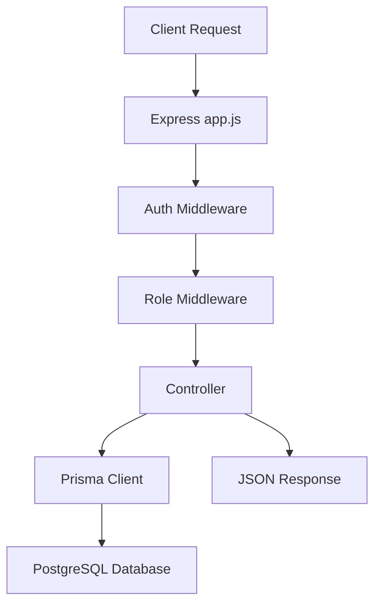

# 🧠 QuizVerse API

<div align="center">


**Backend service for the QuizVerse platform — managing authentication, quiz lifecycle, question banks, attempts, leaderboard stats, and admin analytics.**

</div>

---

## 📋 Overview

The backend is a Node.js + Express REST API built around a PostgreSQL database using Prisma ORM. It supports two primary roles:

- Admin: manages students, categories, quizzes, question banks, and platform analytics
- Student: registers/logs in, browses published quizzes, takes attempts, reviews results, and checks leaderboard performance

The API uses cookie-based JWT authentication, role-based middleware, and Prisma-driven database access for all business logic.

---

## 🧩 Core Features

- User registration and authentication
- Role-based access control with `ADMIN` and `STUDENT`
- Quiz CRUD plus publish/unpublish workflow
- Category management for organizing quizzes
- Question and answer bank management
- Quiz attempt lifecycle:
  - start quiz
  - resume active attempt
  - submit answers
  - calculate result and percentage
  - review completed attempts
- Student dashboard statistics
- Platform analytics and leaderboard generation
- Admin-only user management and status toggling

---

## 🏗️ Architecture



### Request Lifecycle

1. Client sends HTTP request with cookie credentials
2. `app.js` mounts the relevant route file
3. `authenticate` checks JWT token from cookie
4. `isAdmin`, `isStudent`, or `isAuthorizedUser` enforces role rules
5. Controller queries Prisma and processes business logic
6. Database returns data
7. API responds with JSON payload

---

## 📁 Folder Structure

```text
backend/
├── app.js                      # Express app bootstrap and route mounting
├── package.json                # Scripts and dependencies
├── prisma.config.js            # Prisma CLI configuration
├── .env                        # Local environment secrets
├── lib/
│   └── prisma.js               # Prisma client setup with PostgreSQL adapter
├── middlewares/
│   ├── authMiddleware.js       # JWT verification
│   └── roleMiddleware.js       # Role guards
├── controllers/
│   ├── analyticsController.js  # Platform analytics queries
│   ├── attemptController.js    # Quiz attempts lifecycle
│   ├── authController.js       # Login/register/password reset endpoints
│   ├── categoryController.js   # Category CRUD
│   ├── dashboardController.js  # Admin dashboard stats
│   ├── leaderboardController.js # Leaderboard calculations
│   ├── questionController.js   # Quiz question CRUD
│   ├── quizController.js       # Quiz CRUD and status updates
│   ├── studentDashboardController.js # Student metrics
│   └── userController.js       # Student profile and status management
├── routes/
│   ├── adminRoutes.js          # Admin endpoints
│   ├── attemptRoutes.js        # Start/submit/review attempts
│   ├── authRoutes.js          # Public auth routes
│   ├── categoryRoutes.js      # Category routes
│   ├── leaderboardRoutes.js   # Leaderboard routes
│   ├── questionRoutes.js      # Question routes
│   ├── quizRoutes.js          # Quiz routes
│   └── studentRoutes.js       # Student dashboard routes
├── prisma/
│   ├── schema.prisma           # Prisma schema
│   └── migrations/             # Database migrations
└── node_modules/              # Installed dependencies
```

---

## 🧱 Database Model Summary

The project uses Prisma with PostgreSQL and a compact, quiz-focused schema.

### Enums

- `Role`: `ADMIN`, `STUDENT`
- `UserStatus`: `ACTIVE`, `INACTIVE`
- `QuizStatus`: `DRAFT`, `PUBLISHED`, `UNPUBLISHED`
- `Difficulty`: `EASY`, `MEDIUM`, `HARD`
- `AttemptStatus`: `IN_PROGRESS`, `COMPLETED`, `PASSED`, `FAILED`

### Core Models

| Model | Purpose |
|---|---|
| `User` | Admin and student accounts |
| `Category` | Quiz grouping |
| `Quiz` | Quiz metadata, status, and settings |
| `Question` | Question text, marks, difficulty |
| `Option` | Answer choices |
| `Attempt` | A student's attempt record |
| `Answer` | Selected answer for a given question in an attempt |

### Schema Highlights

- Each `User` has a role and account status
- Each `Quiz` belongs to a `Category`
- Each `Quiz` has many `Question`s and `Attempt`s
- Each `Attempt` stores score, percentage, pass/fail result, and timing metadata
- `Answer` records tie a selected option to one specific question within one attempt

---

## 🔐 Authentication & Security

### JWT Authentication

- User login issues a signed JWT
- Token is stored in an `httpOnly` cookie named `token`
- The cookie is sent automatically with authenticated requests

### Middleware Flow

#### `authenticate`
- Reads the cookie
- Verifies the JWT
- Attaches `req.user` payload to the request

#### `isAdmin`
- Allows only `ADMIN` role access

#### `isStudent`
- Allows only `STUDENT` role access

#### `isAuthorizedUser`
- Allows either `ADMIN` or `STUDENT`

### Security Behaviors

- password hashing via `bcrypt`
- invalid or missing token returns `401`
- inactive accounts are blocked during login
- sensitive quiz data is not exposed to students before the quiz is published

---

## 🛣️ API Route Map

### Public Auth Routes

| Method | Route | Purpose |
|---|---|---|
| POST | `/auth/register` | Register a student |
| POST | `/auth/login` | Login and create cookie session |
| POST | `/auth/logout` | Clear auth cookie |
| POST | `/auth/forgotPassword` | Simulated password reset flow |
| POST | `/auth/resetPassword` | Reset password using token |

### Admin Routes

| Method | Route | Purpose |
|---|---|---|
| GET | `/admin/dashboard/stats` | Core admin KPI stats |
| GET | `/admin/analytics` | Popular quizzes, pass/fail stats, trend data |
| GET | `/admin/attempts` | View platform attempts |
| GET | `/admin/users` | Fetch all students |
| GET | `/admin/users/:id` | Student detail + performance |
| PUT | `/admin/users/:id` | Update student info |
| PATCH | `/admin/users/:id/status` | Activate/deactivate student |
| DELETE | `/admin/users/:id` | Delete a student |

### Quiz and Category Routes

| Method | Route | Purpose |
|---|---|---|
| GET | `/quizzes` | Fetch quizzes; students see only published ones |
| GET | `/quizzes/:id` | View a single quiz |
| POST | `/quizzes` | Create a quiz |
| PUT | `/quizzes/:id` | Update quiz |
| DELETE | `/quizzes/:id` | Delete quiz |
| PATCH | `/quizzes/:id/publish` | Update quiz status |
| GET | `/categories` | List all categories |
| POST | `/categories` | Create category |
| PUT | `/categories/:id` | Update category |
| DELETE | `/categories/:id` | Delete category |

### Question Routes

| Method | Route | Purpose |
|---|---|---|
| GET | `/quizzes/:quizId/questions` | Fetch quiz questions |
| POST | `/quizzes/:quizId/questions` | Create a question with options |
| PUT | `/questions/:id` | Update a question |
| DELETE | `/questions/:id` | Delete a question |

### Attempt Routes

| Method | Route | Purpose |
|---|---|---|
| POST | `/quizzes/:quizId/start` | Start or resume attempt |
| POST | `/quizzes/:quizId/submit` | Submit answers and grade attempt |
| GET | `/attempts` | Get logged-in student's attempts |
| GET | `/attempts/:id` | Review completed attempt and answers |

### Student Routes

| Method | Route | Purpose |
|---|---|---|
| GET | `/student/dashboard` | Student overview stats |

### Leaderboard Routes

| Method | Route | Purpose |
|---|---|---|
| GET | `/leaderboard` | Overall, weekly, monthly, or category leaderboard |

---

## ✅ Business Logic Summary

### Quiz Flow

- Admin creates a quiz under a category
- Admin adds questions with exactly one correct option
- Quiz can remain `DRAFT`, `PUBLISHED`, or `UNPUBLISHED`
- Students can only access published quizzes
- Students start attempts, answer questions, and submit for scoring
- The backend calculates:
  - correct answers
  - incorrect answers
  - unanswered count
  - percentage
  - pass/fail result based on `passingScore`

### Student Review Flow

- After submission, the completed attempt can be fetched
- The backend returns a clean structure with:
  - summary statistics
  - question-by-question review
  - selected option
  - correct option
  - explanation and marks

---

## ⚙️ Environment Variables

Create a `.env` file in the backend root:

```env
PORT=your_port
DATABASE_URL=your_db_url
JWT_SECRET=your_super_secret_key
JWT_EXPIRES_IN=your_jwt_expiry_time
```

### Notes

- `DATABASE_URL` is required for Prisma PostgreSQL connection
- `JWT_SECRET` must be strong and kept private
- `PORT` is the app’s listening port

---

## ▶️ Setup & Run

### Install dependencies

```bash
cd backend
npm install
```

### Start development server

```bash
npm run dev
```

### Production start

```bash
npm start
```

### Prisma commands

```bash
npx prisma generate
npx prisma migrate dev
npx prisma studio
```

---

## 📦 Dependencies

### Core

- `express` — API server
- `cors` — cross-origin support
- `cookie-parser` — parse auth cookies
- `dotenv` — environment variables
- `jsonwebtoken` — JWT handling
- `bcrypt` — password hashing

### Database

- `@prisma/client` — Prisma client
- `@prisma/adapter-pg` — Postgres adapter
- `pg` — Postgres driver
- `prisma` — Prisma CLI and migration tooling

### Dev tools

- `nodemon` — auto-reload during development

---

## 🧪 Example Data Flow

### Login

```http
POST /auth/login
Content-Type: application/json

{
  "email": "student@example.com",
  "password": "secret123"
}
```

### Start quiz

```http
POST /quizzes/4/start
Cookie: token=jwt_here
```

### Submit quiz

```http
POST /quizzes/4/submit
Cookie: token=jwt_here

{
  "answers": [
    { "questionId": 10, "selectedOptionId": 23 },
    { "questionId": 11, "selectedOptionId": 26 }
  ]
}
```

---

## 📌 Summary

The backend is a clean, role-based student quiz platform API. It follows a practical MVC-like layout: routes + controllers + middleware + Prisma data access. It is designed to serve a modern React frontend while keeping business rules, scoring logic, and auth decisions at the server layer.

This makes it a strong fit for admin operations, student self-service, and accurate quiz analytics without exposing sensitive logic to the client.
